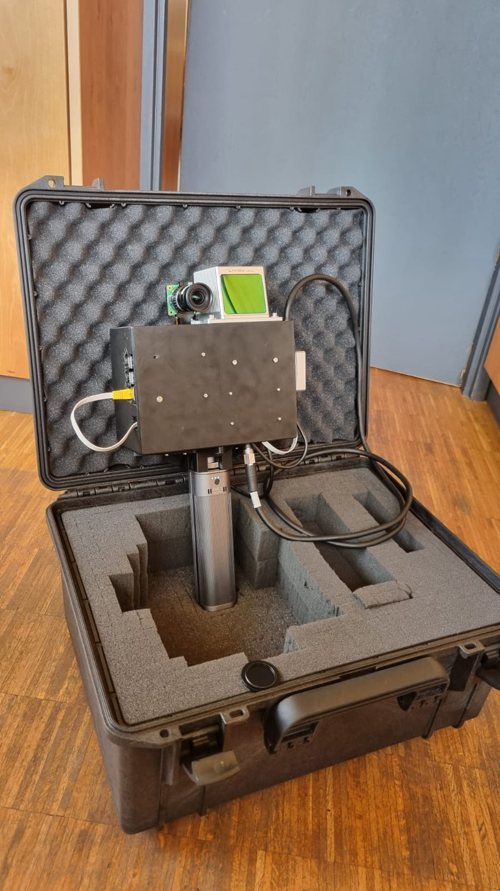
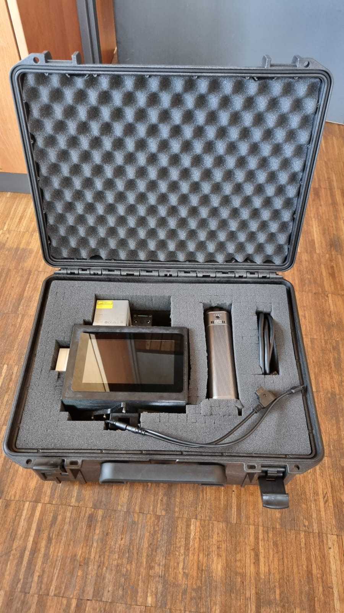

# Raspberry Pi–based LiDAR–Camera Rig (Livox MID-70 + Global-Shutter MonoCam)

> Handheld RGB-D scanner for outdoor/indoor scenes — developed as part of my Bachelor’s thesis at the Chair of Robotics (Informatik XVII), Julius-Maximilians-Universität Würzburg.
---

## TL;DR

This repository contains code and scripts to generate **RGB-D frames** using a **Livox MID-70** and a **Raspberry Pi Global-Shutter mono camera** (Ubuntu 24.04 on Raspberry Pi).  
The goal is a robust pipeline from **ROS recording → synchronized pair export → colored point clouds & depth images → (optional) depth densification → Uni-Fusion-ready outputs**.

> **Note:** An IMU is built into the device but is **not calibrated** yet and is therefore not used in the default pipeline.

---

## Gallery

> Replace the paths with your actual images (e.g., under `docs/images/`). Keep the names below or adapt them here.

  
  

Additional sample outputs:
- `docs/images/sample_rgb.png` — camera frame  
- `docs/images/sample_depth.png` — generated (optionally densified) depth image  
- `docs/images/sample_colored_pcd.png` — colored point cloud

---

## Features

- **Synchronized RGB + LiDAR pairs** from ROS bags (nearest-time matching with configurable tolerance)
- **RGB-D frames** and **colored point clouds**
- **Depth densification** (optional)
- **ICP** (merge/register multiple scans)
- **Output for Uni-Fusion**-compatible output folder structure (RGB, Depth, metadata)

---

## Hardware

- **LiDAR:** Livox MID-70 (solid-state)
- **Camera:** Raspberry Pi Global-Shutter MonoCam and IDS-2M12-C0420, 4 mm, 1/2
- **Compute:** Raspberry Pi running **Ubuntu 24.04**
- **IMU:** BNO085, currently **uncalibrated** (not used yet)

---

## Software Stack & Dependencies

- **ROS 2 Jazzy**
- Python ≥ 3.10
- **Open3D** ≥ 0.19
- NumPy, OpenCV-Python, Pillow
- `rclpy`, `rosbag2_py`, `sensor_msgs_py`
- (optional) Matplotlib for visualization
